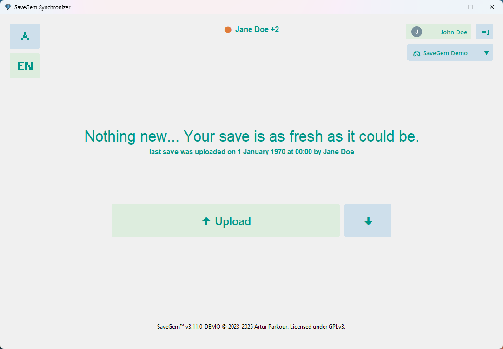

# 💎 SaveGem – Save Manager for PC Games


## 📌 Overview
**SaveGem** is a simple desktop application built with **PyQT** that allows players to **upload and download save files to Google Drive**.  

It’s designed for games that:
- Don’t have official cloud save support.
- Host servers directly on the player’s PC.
- Require manual save sharing between friends or across multiple devices.

With SaveGem, you can seamlessly keep your save games **backed up and in sync**.

---

## 🚀 Features
- ✅ Works for any game where saves are stored locally
- ✅ Easy-to-use desktop UI (PyQT)
- ✅ No manual reload! UI updates automatically
- ✅ Upload local save files to Google Drive  
- ✅ Download the latest save files from the drive
- ✅ Backs up previous save files before downloading save from cloud   
- ✅ Shows if any players are currently in the game
- ✅ Auto Mode. Allows to upload/download saves automatically!

---

## 🛠️ Building
### Prerequisites
- **Python 3.9+** (with `pip`)  
- Google Cloud credentials (service account or OAuth client)  
- In order to build EXE or just be able to use application you need file called `credentials.json` to be in root of the project
- You also need `config.json` to be present in root directory with ID of Google Drive game config. (See [placeholder file](./config.json.placeholder)) 

### Install dependencies and Build
Application is specific to **Windows**, but you can build it on Linux.
#### Linux
```bash
./scripts/linux/build.sh
```
####
Windows
```powershell
./scripts/windows/build.ps1
```

## 📦 Installer (Inno Setup)

The Windows installer for **SaveGem** is built using **[Inno Setup](https://jrsoftware.org/isinfo.php)**.  
We provide an `.iss` script in the repository, so you can create your own installer if needed.

### Build the Installer Yourself
1. Download and install [Inno Setup 6+](https://jrsoftware.org/isdl.php).  
2. Open `scripts/installer/setup.iss`.  
3. Compile the script from within Inno Setup to generate the `.exe` installer.

> ℹ️ **Note**: The `.iss` file is only a configuration script. Inno Setup itself is **not** distributed with SaveGem; you’ll need to install it separately if you want to build the installer.


## ⚖️ Licensing

- Application code: GPLv3 (see [LICENSE](LICENSE))
- Dependencies and assets: see [NOTICE.md](NOTICE.md) for details
